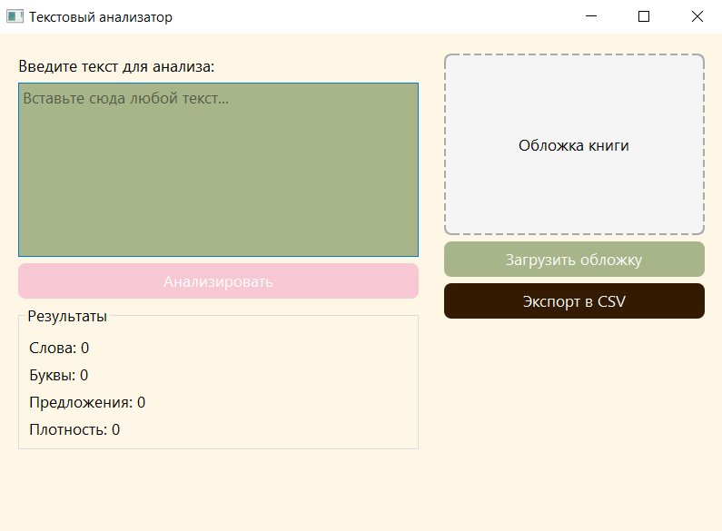

# Текстовый анализатор

Приложение для анализа текста: подсчёт количества слов, букв, предложений и плотности текста. Разработано на Python с использованием PyQt5.

## Демонстрация

## Возможности

- Подсчёт количества слов в тексте
- Подсчёт количества букв (только русские и английские буквы)
- Подсчёт количества предложений
- Расчёт плотности текста (отношение слов к буквам)
- Игнорирование пустых строк
- Загрузка изображения обложки книги через Pillow
- Подтверждение выхода из программы
- Экспорт результатов анализа в CSV
- Горячие клавиши:
  - Ctrl+Enter / Ctrl+Return — анализ текста
  - Ctrl+E — экспорт в CSV

## Запуск проекта

1. Создайте виртуальное окружение: `python -m venv venv`
2. Активируйте:
- Windows: `venv\Scripts\activate`
- macOS/Linux: `source venv/bin/activate`

3. Установите зависимости: `pip install -r requirements.txt`
4. Запустите:`python main.py`

## Структура проекта

- `main.py` → Точка входа, настройка QApplication
- `ui_main.py` → Интерфейс и логика приложения
- `requirements.txt` → Зависимости проекта
- `.gitignore` → Исключения для Git
- `README.md` → Описание проекта

## Как пользоваться

1. Введите текст в поле ввода.
2. Нажмите кнопку **«Анализировать»**.
3. Результаты отобразятся в блоке «Результаты».
4. При желании загрузите обложку книги через кнопку **«Загрузить обложку»**.
5. Экспортируйте результаты в CSV через кнопку «Экспорт в CSV» или Ctrl+E.

## Технологии

- Python 3
- PyQt5
- Pillow (обработка изображений)
- re (регулярные выражения)

## Автор

Васильева Дарья, группа ФМ-14-25

## Ссылка на репозиторий

https://github.com/dashavasileva505/Practice